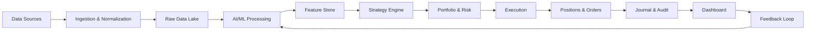

# RoboOtec.ai – MVP architektura prediktivní AI trading platformy

Tento dokument shrnuje kompletní cílovou architekturu MVP pro plně autonomní prediktivní AI platformu RoboOtec.ai. Vychází z dodaných materiálů (projektová dokumentace MVP, POC objednávka) a rozšiřuje je o požadavek na plnou automatizaci, multi‑asset pokrytí a kontinuální učení strategií.

## 0) Zásady MVP (aktualizace)
- Pouze veřejná data a bezplatné nástroje (open‑source nebo free‑tier).
- Žádné placené datové zdroje ani uzavřené komerční AI modely v MVP.
- Architektura musí umožnit rychlou výměnu zdrojů dat i modelů bez přepisu systému.

## 1) Cíl MVP
Postavit plně automatický systém, který:
- sbírá a zpracovává tržní, makro, news a sentiment data,
- tvoří predikce trhu pomocí AI a kvantitativních modelů,
- generuje, porovnává a vybírá nejlepší strategie,
- aplikuje risk management, provádí exekuci a spravuje pozice,
- vede auditní stopu, journal a poskytuje dashboard,
- umožňuje 6+ měsíců backtest a následný paper trading v reálném čase.

## 2) MVP rozsah a instrumenty
MVP bude schopné obsloužit tyto segmenty:
- NASDAQ (index a top 10 akcií)
- EUR/USD
- Zlato (XAU/USD)
- Bitcoin (BTC/USD)
- Vyhledávání podhodnocených akcií (value screener)

Každá strategie má alokovaný budget 100 000 USD. Systém průběžně porovnává strategie, přiděluje kapitál a reportuje výsledky.

## 3) Architektura – high‑level

## 4) Funkční vrstvy a komponenty

### 4.1 Datová vrstva (Ingestion)
- Tržní data: realtime i historická data pro akcie, FX, komodity a krypto
- Makro data: kalendář událostí, CPI, NFP, FOMC, GDP, PMI, VIX
- News: finanční zpravodajství, RSS, licencované zdroje
- Sociální sítě a komunita: StockTwits, další relevantní zdroje
- Specifické zdroje: pouze legálně dostupné veřejné zdroje

Moduly:
- konektory na API (REST, WebSocket)
- scraping/aggregace (tam, kde je legální)
- data quality gate (validace, deduplikace, anomálie)
- normalizace do jednotného schématu

### 4.2 Datové úložiště
- Raw Data Lake pro nezpracovaná data
- Time‑series DB pro tick a bar data
- Document DB pro news/sentiment a texty
- Feature Store pro modelové vstupy

### 4.3 AI/ML vrstva
- Sentiment a topic analysis (LLM + NLP pipeline)
- Predikční modely časových řad (statistické modely, ML, deep learning)
- Anomálie, event detection
- Model registry a orchestrace pro open‑weight modely + klasické NLP

Výstupy:
- sentiment score + confidence
- price move prediction (horizonty 5m, 1h, 1d)
- klasifikace trhu (bull/bear/neutral)

### 4.4 Strategy Engine
- Knihovna strategií: trend following, mean reversion, news‑event, breakout
- AI‑assisted strategy optimizer (parametrická optimalizace)
- Generátor nových strategií (kombinace signálů, modelových výstupů, filtrů)
- Standardizovaný formát strategie (vstup, logika, výstup)

Každá strategie:
- má vlastní kapitál 100 000 USD
- má definované rizikové limity
- běží na společné datové vrstvě

### 4.5 Portfolio & Risk Management
- Pre‑trade kontrola: limity pozic, exposure, max drawdown
- Position sizing: Kelly/volatility‑based sizing
- SL/TP a trailing stop
- Globální pojistky (circuit breaker)
- Dynamická alokace kapitálu podle výkonu strategií

### 4.6 Execution Layer
- Orchestrátor objednávek (Order Management System)
- Broker API (paper trading / live)
- Sledování slippage a transakčních nákladů
- Realtime pozice a P&L

### 4.7 Backtesting & Simulation
- Event‑driven backtest
- Min. 6 měsíců historických dat
- Report: win rate, profit factor, drawdown, Sharpe
- Validace stability strategie (rolling windows)

### 4.8 Journal & Audit
- Plná auditní stopa každého rozhodnutí
- Log vstupů, AI výstupů, strategie, risk výpočtů
- Důvody vstupu/výstupu z pozice
- Zhodnocení a lessons learned

### 4.9 Dashboard & Reporting
- Live P&L, pozice, signály
- Porovnání výkonu strategií
- Risk metriky (exposure, drawdown, VaR)
- Makro kalendář a sentiment heatmap
- Audit viewer

### 4.10 Model Selection & Continuous Learning
- Benchmarking modelů a strategií na společném valid datasetu
- Autom. re‑rank strategií podle výkonu a stability (rolling windows)
- Trvalé učení: feedback z paper tradingu a backtestu

## 5) Datové zdroje a integrace (MVP)
- Tržní data: Stooq (public CSV) pro historické ceny; Alpaca jako fallback (free‑tier)
- News: otevřené datové zdroje (GDELT GKG)
- Makro: veřejné databáze (FRED, ECB Data Portal)

Poznámka: všechny zdroje musí být licencované a v souladu s právními podmínkami.

## 6) Technologický stack (doporučený)
- Frontend: React 18 + TypeScript
- Backend Core: .NET 8 nebo Python (MVP preferuje Python pro rychlost vývoje)
- AI Services: Python + FastAPI
- Message Queue: RabbitMQ
- Databáze: PostgreSQL + TimescaleDB, MongoDB, Redis
- Observability: Prometheus + Grafana
- Infrastructure: Docker + Kubernetes

## 7) Non‑functional požadavky
- Latence signálu: <5–10 sekund
- Auditovatelnost: 100% log vstupů a rozhodnutí
- Dostupnost: 99.5%+ (v MVP)
- Škálovatelnost: >100k signálů denně

## 8) MVP roadmap (doporučení)
- Fáze 1: Ingestion + Data Quality + Market Data
- Fáze 2: AI pipeline + sentiment + základní predikce
- Fáze 3: Strategy Engine + Backtest
- Fáze 4: Risk + Execution + Paper trading
- Fáze 5: Dashboard + Journal + Audit

## 9) Kritéria úspěchu MVP
- Backtest min. 6 měsíců
- Paper trading v reálném čase
- Strategie s win rate >60% a PF >1.5
- Funkční audit log a dashboard

## 10) Bezpečnost a důvěrnost
- Šifrování dat v klidu i při přenosu
- RBAC pro přístup
- Audit log a detekce změn
- Oddělená prostředí (dev / staging / prod)

---

Doporučení: po odsouhlasení této architektury vytvoříme detailní komponentní specifikace, API kontrakty a backlog pro implementaci.
